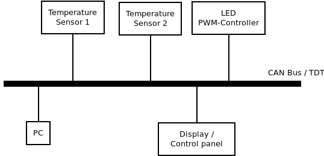

# Liblepto

<div align="center" width="100%" style="vertical-align: middle;" valign="middle">
    
</div>

## Overview

TDT is an CAN based protocol for simple sensor values. TDT ( trivial data 
types ) messages contain information about the data type of the payload.
Like on CANOpen each node has an object catalogue. The library can be used on small 
microcontrollers with flash down to 16KB.

<div align="center" width="100%" style="vertical-align: middle;" valign="middle">
    
</div>

Ont the first level, the data flow resembles a disorganized yelling. Each node 
can send measured values without destination. Another node can evaluate them 
if interested. There is not directly central master.
At a further layer, there is the Multi-Message Packet Protocol. This defines 
the protocol for exchanging larger amounts of data between two nodes. This can 
be used to perform firmware updates via CAN for example.

This repository provides:

* Library for Microcontroller
* Library for host PC with class for generating human readable string from magic 
numbers (objects, units, values etc.)
* Code generator to provide c++ enumerations of objects and defines for logging

The available objects of the nodes can be specified with custom JSON files.

Example:
```
{
   "profiles": [
      {
         "name": "Environment",
         "description": "Environment sensors like temperatures, VOC, humidity",
         "objectsOffset": "0x400",
         "size": "0x10",
         "objects": [
            {
               "address": "0x0014",
               "name": "Air humidity",
               "description": "Air humidity",
               "example": "40 %"
            },
            {
               "address": "0x0018",
               "name": "Temperature",
               "example": "22.35°C",
               "size": "8",
               "unit": "centi degree"
            }
         ]
      }
   ]
}
```

The library does not provide something like an message processing event loop. 
This has to be implemented by the application.

## Usage

This repository can be integrated into an CMake project as subdirectory 
('add_subdirectory( libtdt') via git submodules. The application then can link 
against libtdt.

Example for sending Message (room temperature):
```
Tdt::CMessage temperatureMessage(0x53, Tdt::EFunctionCode::sendObject
                      , Tdt::EObject::environmentTemperature
                      , Tdt::EUnit::centiCelsius
                      , Tdt::SValue{._int=2300}
                      );
m_can << message;
```

For handling the CAN bus itself, [CANHub](https://github.com/maxses/canhub) can be used.

